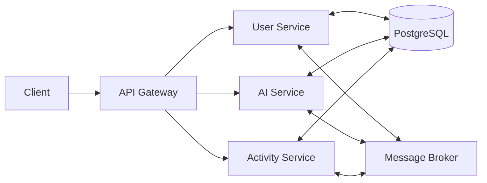

# Enterprise Microservices Platform

## 📋 Overview
A robust, scalable microservices platform designed to handle complex business requirements with high availability and performance. This platform leverages Spring Boot and modern cloud-native technologies to provide a flexible, maintainable architecture that can evolve with your business needs.

## 🎯 Business Value
This platform addresses the growing need for:
- **Scalability**: Independent scaling of services based on demand
- **Resilience**: Isolated failures that don't impact the entire system
- **Technology Diversity**: Freedom to use different technologies per service
- **Continuous Delivery**: Independent deployment cycles for different services
- **Team Autonomy**: Cross-functional teams can develop and deploy independently

## 🏗️ Architecture Overview

### Core Components

#### 1. API Gateway (server)
- **Purpose**: Single entry point for all client requests
- **Key Features**:
  - Request routing and load balancing
  - Authentication and authorization
  - Rate limiting and circuit breaking
  - Request/response transformation

#### 2. User Service (userservice)
- **Purpose**: Centralized identity and access management
- **Key Features**:
  - User registration and authentication (OAuth2/JWT)
  - Role-based access control (RBAC)
  - Profile management
  - Session management

#### 3. AI Service (aiservice)
- **Purpose**: AI/ML capabilities integration
- **Key Features**:
  - Natural language processing
  - Predictive analytics
  - Intelligent recommendations
  - Data processing pipelines

#### 4. Activity Service (activityService)
- **Purpose**: System monitoring and analytics
- **Key Features**:
  - User activity tracking
  - System performance metrics
  - Audit logging
  - Real-time monitoring

## 🚀 Technical Prerequisites

### Development Environment
- **JDK 17+** (Amazon Corretto 17 recommended)
- **Apache Maven 3.6.3+** (for dependency management)
- **Docker 20.10+** (for containerization)
- **Docker Compose** (for local development)

### Infrastructure
- **Database**: PostgreSQL 13+ (or compatible RDBMS)
- **Message Broker**: RabbitMQ 3.9+ or Apache Kafka
- **Caching**: Redis 6.0+
- **Container Orchestration**: Kubernetes (for production deployment)

### Development Tools
- **IDE**: IntelliJ IDEA (recommended) or VS Code
- **Build Tools**: Maven Wrapper (included)
- **Version Control**: Git 2.30+
- **API Testing**: Postman or cURL

## 🛠️ Installation

1. **Clone the repository**
   ```bash
   git clone [your-repository-url]
   cd MicroServices
   ```

2. **Build all services**
   ```bash
   # Build all services with tests
   mvn clean install -DskipTests
   
   # Or build with tests (requires running infrastructure)
   # mvn clean install
   ```

3. **Configure environment variables**
   Create a `.env` file in the root directory with the following variables:
   ```env
   # Database Configuration
   SPRING_DATASOURCE_URL=jdbc:postgresql://localhost:5432/microservices
   SPRING_DATASOURCE_USERNAME=your_username
   SPRING_DATASOURCE_PASSWORD=your_password
   
   # JWT Configuration
   JWT_SECRET=your_jwt_secret_key_here
   JWT_EXPIRATION_MS=86400000  # 24 hours
   
   # Service Ports
   SERVER_PORT=8080
   USER_SERVICE_PORT=8081
   AI_SERVICE_PORT=8082
   ACTIVITY_SERVICE_PORT=8083
   ```

## 🏃‍♂️ Running the Application

### Local Development

#### Option 1: Run Services Individually
```bash
# Start the database and message broker
docker-compose -f docker-compose.infrastructure.yml up -d

# In separate terminals, start each service:
cd server && mvn spring-boot:run
cd ../userservice && mvn spring-boot:run
cd ../aiservice && mvn spring-boot:run
cd ../activityService && mvn spring-boot:run
```

#### Option 2: Docker Compose (Recommended)
```bash
# Start all services with a single command
docker-compose -f docker-compose.yml -f docker-compose.infrastructure.yml up --build
```

### Production Deployment
For production environments, we recommend using Kubernetes with the provided Helm charts:
```bash
# Deploy to Kubernetes
helm install microservices ./kubernetes/helm
```

## 🔍 System Architecture

### Communication Flow
1. **Client** → **API Gateway** (Authentication & Routing)
2. **API Gateway** → **Microservice** (Request Processing)
3. **Microservice** → **Database** (Data Persistence)
4. **Microservice** → **Message Broker** (Event Publishing)
5. **Other Services** (Event Consumption & Processing)

### Data Flow


## 📚 API Documentation

### Interactive API Documentation
Access the Swagger UI for each service when running locally:

| Service | URL | Description |
|---------|-----|-------------|
| API Gateway | http://localhost:8080/swagger-ui.html | Main entry point for all API requests |
| User Service | http://localhost:8081/swagger-ui.html | User management and authentication |
| AI Service | http://localhost:8082/swagger-ui.html | AI/ML capabilities and integrations |
| Activity Service | http://localhost:8083/swagger-ui.html | System monitoring and analytics |

### API Versioning
All APIs follow the versioning pattern: `/api/v{version}/resource`

### Authentication
```http
GET /api/v1/secure-endpoint
Authorization: Bearer your-jwt-token
```

### Rate Limiting
- 100 requests/minute per IP for public endpoints
- 1000 requests/minute per user for authenticated endpoints

## 🧪 Testing Strategy

### Unit Tests
```bash
# Run unit tests for all services
mvn test

# Run tests for a specific service
cd userservice && mvn test
```

### Integration Tests
```bash
# Start test containers
mvn verify -Pintegration-test

# Run with coverage report
mvn jacoco:report
```

### Performance Testing
```bash
# Run load tests with JMeter
mvn jmeter:jmeter
```

### Test Coverage
- Minimum 80% code coverage required
- Mutation testing with PITest
- SonarQube integration for code quality

## 🤝 Contributing

We welcome contributions! Please follow these guidelines:

### Development Workflow
1. Fork the repository and create a feature branch
2. Follow our [Git Flow](https://nvie.com/posts/a-successful-git-branching-model/) branching strategy
3. Write clear, concise commit messages following [Conventional Commits](https://www.conventionalcommits.org/)
4. Ensure all tests pass and add new tests as needed
5. Update documentation for any new features or changes
6. Open a Pull Request with a clear description of changes

### Code Style
- Follow [Google Java Style Guide](https://google.github.io/styleguide/javaguide.html)
- Use meaningful variable and method names
- Keep methods small and focused
- Add Javadoc for public APIs

### Pull Request Process
1. Ensure your code builds successfully
2. Run all tests and verify they pass
3. Update the CHANGELOG.md
4. Request review from at least one maintainer

## 📄 License

This project is licensed under the Apache License 2.0 - see the [LICENSE](LICENSE) file for details.

## 🛡️ Security

### Reporting Vulnerabilities
Please report any security vulnerabilities to security@yourcompany.com

### Security Best Practices
- Always use HTTPS in production
- Rotate secrets and keys regularly
- Follow the principle of least privilege
- Keep dependencies up to date
- Regular security audits and penetration testing

## 🌟 Features

### Current Features
- [x] JWT-based authentication
- [x] Role-based access control
- [x] API Gateway with rate limiting
- [x] Distributed tracing with Sleuth and Zipkin
- [x] Centralized configuration with Spring Cloud Config
- [x] Containerized deployment

### Upcoming Features
- [ ] GraphQL API layer
- [ ] Multi-factor authentication
- [ ] Advanced monitoring with Prometheus and Grafana
- [ ] Automated canary deployments

## 📊 Project Status

| Component | Status | Version |
|-----------|--------|---------|
| API Gateway | ✅ Production Ready | 1.0.0 |
| User Service | ✅ Production Ready | 1.0.0 |
| AI Service | 🚧 Beta | 0.9.0 |
| Activity Service | ✅ Production Ready | 1.0.0 |

## 🔧 Technology Stack

### Backend
- **Framework**: Spring Boot 3.1.x
- **API Documentation**: SpringDoc OpenAPI 3.0
- **Database**: PostgreSQL 14 with Flyway migrations
- **Caching**: Redis 7.0
- **Message Broker**: RabbitMQ 3.11
- **Containerization**: Docker 20.10+, Kubernetes 1.24+
- **CI/CD**: GitHub Actions, ArgoCD

### Monitoring & Observability
- **Logging**: ELK Stack (Elasticsearch, Logstash, Kibana)
- **Metrics**: Prometheus, Grafana
- **Tracing**: Jaeger
- **Alerting**: Alertmanager

## 🤝 Community

### Get Help
- [GitHub Issues](https://github.com/yourusername/microservices-project/issues)
- [Discord Community](https://discord.gg/your-community)
- [Documentation](https://docs.yourproject.com)

### Contributors

<a href="https://github.com/yourusername/microservices-project/graphs/contributors">
  
</a>

## 📝 Changelog

See [CHANGELOG.md](CHANGELOG.md) for a detailed history of changes.

## 📄 License

This project is licensed under the Apache License 2.0 - see the [LICENSE](LICENSE) file for details.

---

<div align="center">
  <sub>Built with ❤️ by Your Team</sub>
</div>
